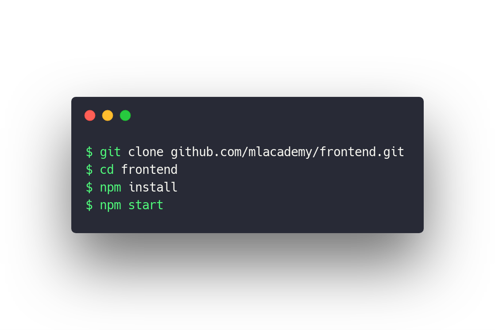

# Actual mlAcademy Frontend Source

_Written in React (w/ React Router, styled-components, Hooks, Bulma, Axios, Ace Editor + more)_

**Available at [https://mlacademy.ml](https://mlacademy.ml)**

Authored by:

- Adam Peace
- Sotirios Vavaroutas
- Samuil Stoychev

### Run it locally

_Make sure you have npm installed_

_To adapt the base application for another use, you'll need to duplicate and rename /src/assets.example and modify everything in src/assets to suit your needs_
